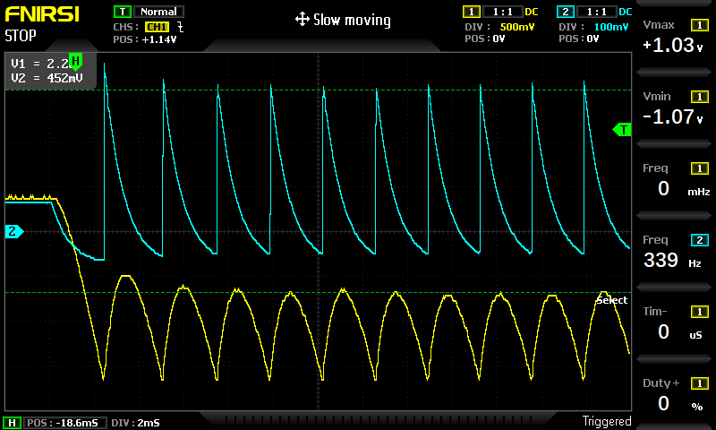
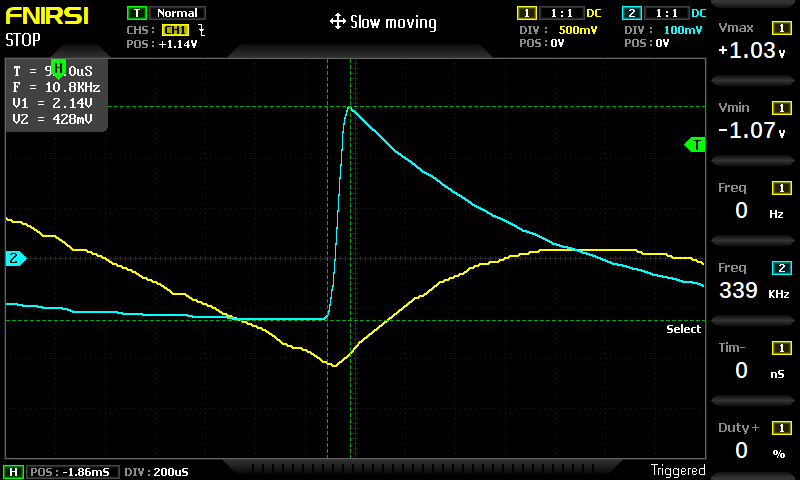
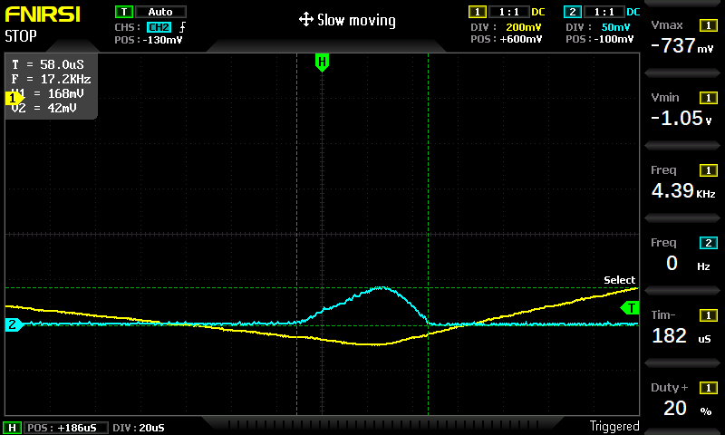
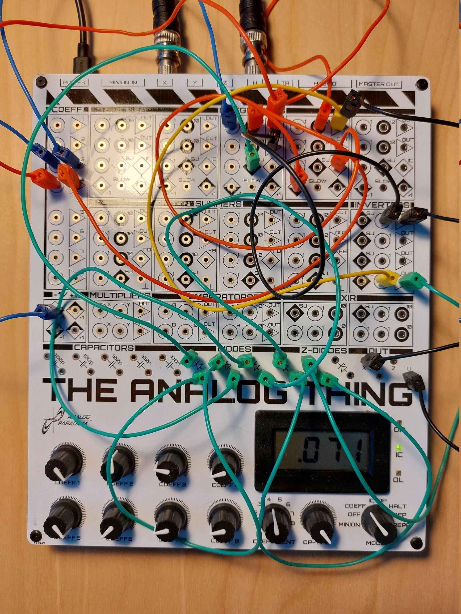
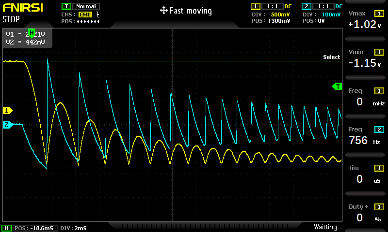
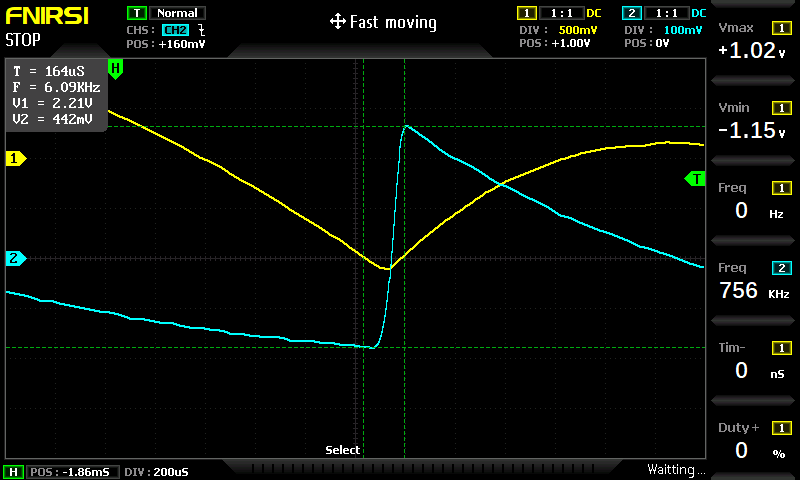
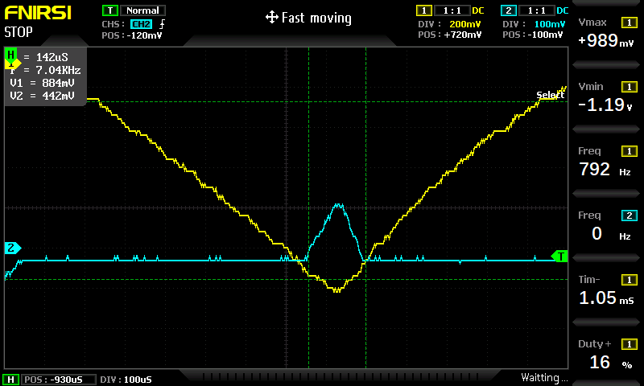
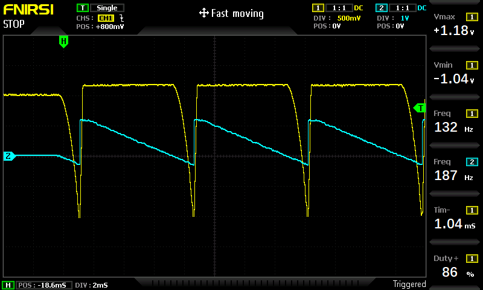
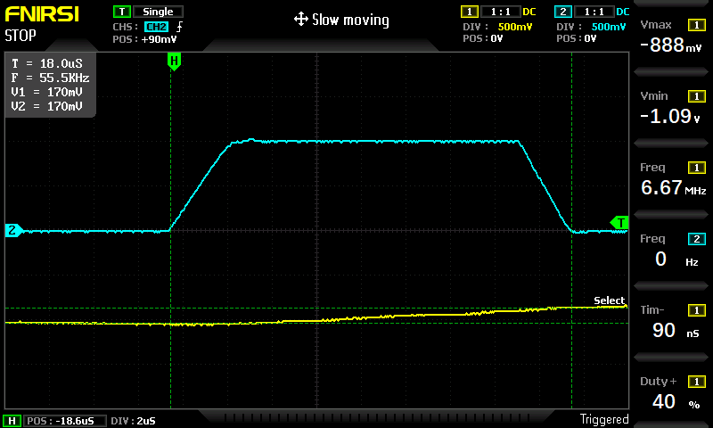

# Bouncing Ball

The [FIRST STEPS](../THAT_First_Steps.pdf) describes in chapter 9.9 a Bouncing Ball System. 

I have focused only on height simulation. The critical part is the bouncing itself when the ball hits the ground. 

The system is modeled by this equation:

#### Free fall with drag at y > -1
y"(t) = -g - d * y'(t)

#### Bouncing action - the ball is below floor at y < -1
y"(t) = -g - d * y'(t) + c * (-y(t) - 1) for y<-1, meaning that ball is under the floor

*  y(t) is the vertical displacement (at start y = 1, floor is at y = -1, the ball goes bellow y = -1 when it bounces of)
*  y'(t) is the velocity (positive when the ball goes up, negative when it goes down)
*  y"(t) is the acceleration
*  d is the drag. The drag force is `-d * y'`, and it's directed against the velocity.  When the object falls, `y'<0`, and the drag force is positive (up). When the ball rises `y'>0`, the drag force is negative (down).
*  c is the spring coefficient for bouncing off the ground. (The force from the floor is directed up and equals  `c * (-y - 1)`. For example, for y = -1.1, we will get bouncing force `c * 0.1` )

## Bouncing action
`c * (-y - 1) for y<-1` is implemented via 10V Zener diode. A voltage of -10V represents -1 unit value. This is inverted, so when voltage drops below -1, the voltage at inverter output is over 10V, and the Zener diode becomes conductive. The current flows to the integrator's SJ (Summing Junction) pin, directly charging the capacitor in the Integrator. However, this works as intended only when the velocity before impact is the same as after the impact. On my THAT computer, this is different. The current through the Zener diode is asymmetrical, leading to higher exit velocity than impact velocity. This breaks the model. 

## Configuration with one diode between the Zener diode and SJ pin of the Integrator (as described in [FIRST STEPS](../THAT_First_Steps.pdf))
Here are the results for g=0.16 and d=0.12.

We can see that the model does not describe the reality. After the first few bounces, the system reaches a steady state, and the ball reaches a steady height. Here, displacement is in yellow, and speed is in blue. 

At the first bounce, the exit speed is almost 3x higher than the impact speed:

This graph shows the voltage at the diode. It represents the bounce force. Notice how it's skewed to the right. This is why the exit velocity is higher than the impact velocity. 

## Configuration with four diodes between the Zener diode and SJ pin of the Integrator
I have tried to mitigate the problem by inserting three additional diodes between the Zener diode and SJ pin of the Integrator, so all four diodes from THAT board were chained after the Zener diode. The bounding force represented by Zener current got smaller, increasing charging time from 160 to 210 microseconds, but the disproportion between exit and impact velocity was lower. See the wiring:

Here are the results for g=0.16 and d=0.07.

  * Displacement (yellow) and velocity (blue) as the function of time. Notice that the ball velocity after the bounce has increased. This is wrong.

  * Here, we see the first bounce in detail. The exit speed is about 1.3x higher than the impact speed. It is still bad but significantly better than a 3x increment when only one diode is used. 

  * The bouncing force is measured as the voltage at the Zener diode output. We see that it's unsymmetric, leading to the exit velocity being higher.

## Replacing Zener diode with comparator
I have attempted to use a comparator instead with the following inputs:
*  A: y
*  B: +1
*  A+B>0: GND
*  A+B<0: 1

 It made the problem even worse - the exit velocity is about 5x higher than the exit velocity - see the blue curve. 

Analyzing the bouncing force (comparator output) reveals we are getting a square wave with a very short duty time of about 18 microseconds. The main problem is a 
[hysteresis](https://en.wikipedia.org/wiki/Hysteresis). The voltage difference to turn the comparator high and back low is about 170mV. This causes the exit velocity to be much higher than the input velocity. 

