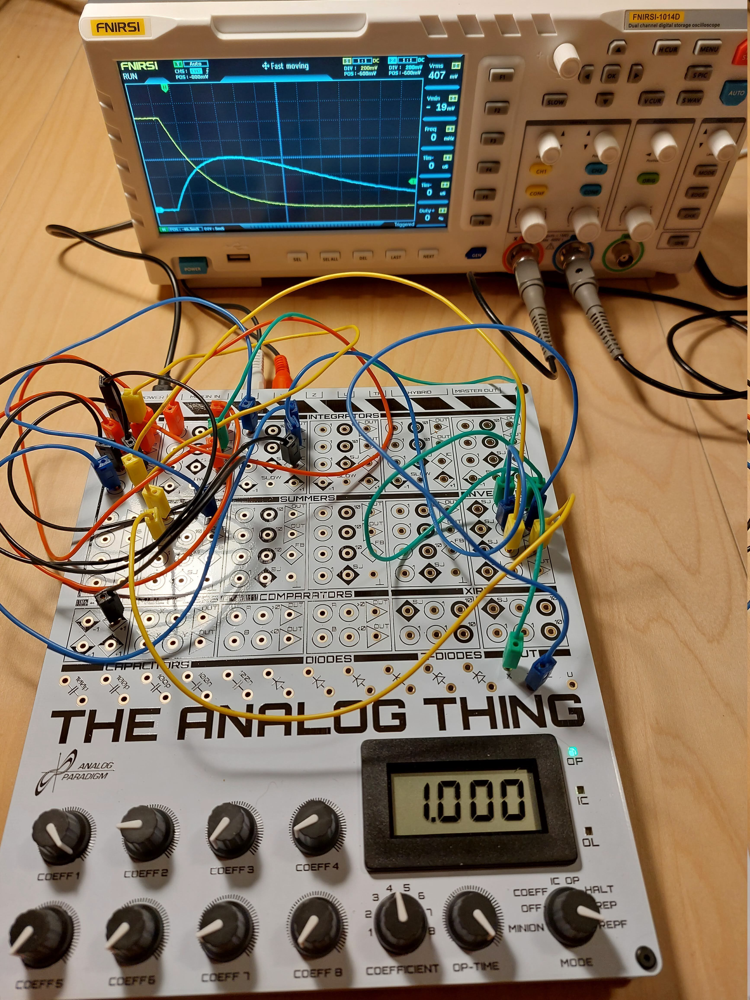
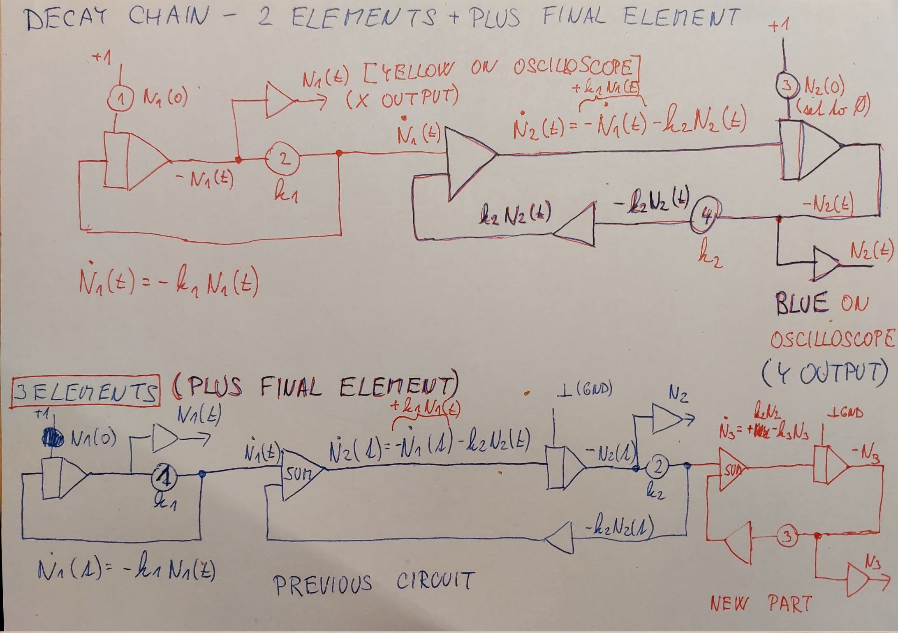

# Decay chain

The [FIRST STEPS](../THAT_First_Steps.pdf) describes in chapter 9.1 Radioactive decay model.

This can be easily expanded in Decay chain, where the first emelemnt N1 decays into element N2, which also decays.

The model is described by equations:

dN1/dt = -k1 * N1

dN2/dt = -dN1/dt - k2 * N2

This translates directly to schematics. Notice that we need to add inverter for - k2*N2(t) branch as summer implicitly inverts its output. 

and wiring 

Dynamics of the system:

yellow: N1(t), N1(t=0) = +1 (THAT units)

blue:   N2(t), N2(t=0) = 0  (THAT units)

Sample waveforms:

## 3 elements (plus final element)

Further expansion to 3 elemenents (plus final element) is straightforward. We simply add the equation:

dN3/dt = -dN2/dt - k3 * N3

and connect it via summer to the exisitng circuit the same way, as we have added cicuit for N2(t) in previous step. See schematics: .

 shows the sample implementation. Since I have only 2 channel oscilloscope available, only N2(t) (blue) and N3(t) (yellow) are displayed. Coefficients 1-3 are set to emulate this scenario:
* N1 - fast decay (coeff 1 - 0.58)
* N2 - intermediate decay speed (coeff 2 - 0.45)
* N3 - slow decay speed (coeff 3 - 0.11) 

* Notice, how element N3 (yellow) builds up, surpassing the amount of elelement N2, before decaying into the final product.

