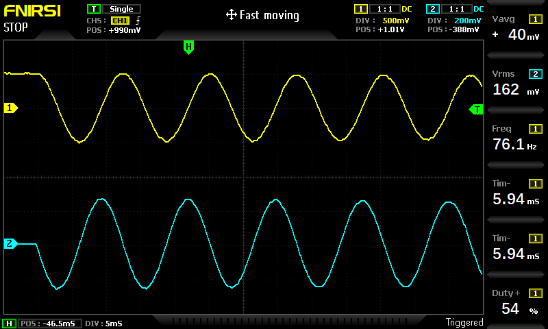

# Mass Spring Damper System

The [FIRST STEPS](../THAT_First_Steps.pdf) describes in chapter 9.2 a Mass Spring Damper System. 

The system is modelled by this equation:

y"(t) = 1/m(-(D y'(t) + s y ))

*  y(t) is the vertical displacement (in equilibrum y == 0)
*  y'(t) is the velocity
*  y"(t) is the acceleration
*  m is the mass
*  D is the damping coefficient (Damping Force is modelled as (- D y'(t) ) - D times the speed of mass y'(t))
*  s is the spring coefficient (Spring Force is (- k y(t) ) )

## Underdamped suspension
I have started the simulation using the recommended parameters:
* THAT coef 1: y(0) = 0.5 (initial displacement)
* THAT coef 2: s = 0.5 (spring coefficient)
* THAT coef 3: D = 0.04 (Damping coeffiecint)
* THAT coef 4: 1/m = 0.5 (inverted mass value)

In this mode, damping is very low and we get almost harmonic oscillations. The speed is phase shifted from displacement by Pi/2 (90 degrees). 

