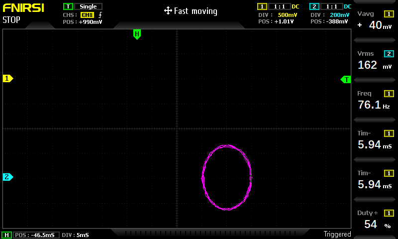
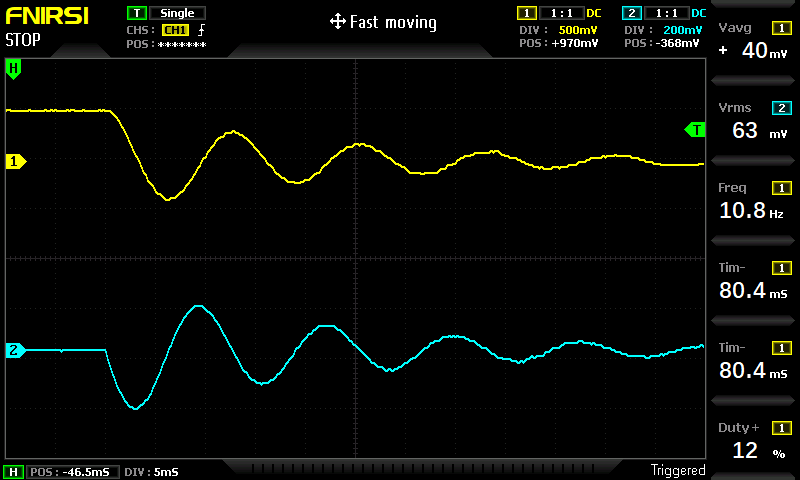
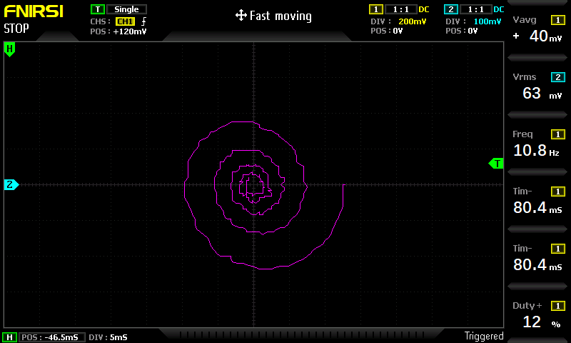
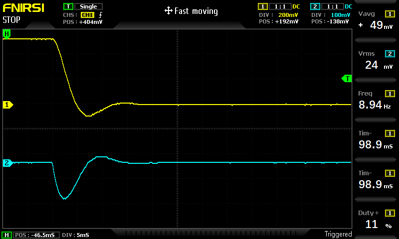
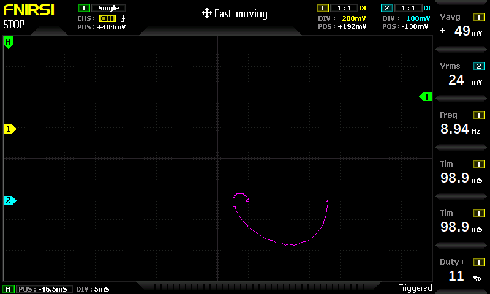
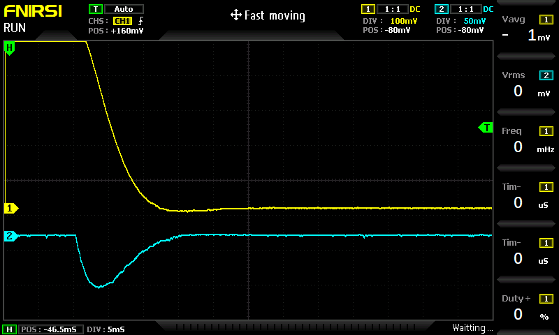
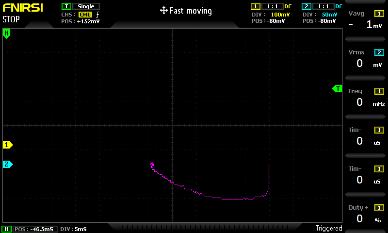

# Mass Spring Damper System

The [FIRST STEPS](../THAT_First_Steps.pdf) describes in chapter 9.2 a Mass Spring Damper System. 

The system is modelled by this equation:

y"(t) = 1/m(-(D y'(t) + s y ))

*  y(t) is the vertical displacement (in equilibrum y == 0)
*  y'(t) is the velocity
*  y"(t) is the acceleration
*  m is the mass
*  D is the damping coefficient (Damping Force is modelled as (- D y'(t) ) - D times the speed of mass y'(t))
*  s is the spring coefficient (Spring Force is (- k y(t) ) )

## Underdamped suspension
I have started the simulation using the recommended parameters:
* THAT coef 1: y(0) = 0.5 (initial displacement)
* THAT coef 2: s = 0.5 (spring coefficient)
* THAT coef 3: D = 0.04 (Damping coeffiecint)
* THAT coef 4: 1/m = 0.5 (inverted mass value)

In this mode, damping is very low and we get almost harmonic oscillations. 

The speed is phase shifted from displacement by Pi/2 (90 degrees). (x coordinate = displacement, y coordinate = speed). Note that diameter of circles is slowly getting smaller, which represents the damping.

## Moderate damping
* THAT coef 3: D = 0.18 (Damping coeffiecint)

We observe that amplitude is falling down.   

Phase diagram is a nice spiral. 

## Strong damping
* THAT coef 3: D = 1.0 (Damping coeffiecint)

In this mode, displacement comes quickly to equilibrum, but it still overshoots into other direction. 

Phase diagram illustrates the overshooting as well.

## Suspension tuning
Here I have attempted to tune the suspension to sweet spot, reducing any overshooting. It has required to lower the spring coeefiecint, meaning lower oscillation frequency and thus longer time to reach the equilibrium. The goal is find a balance between the time to reach equilibrium and at the same time minimize the overshooting. 
* THAT coef 2: s = 0.2 (spring coefficient)
* THAT coef 3: D = 1.0 (Damping coeffiecint)

  

  We reach the equlibrium almost at the same time as with D=1.0 and s=0.5 above, but this time without any overshooting. 
  
